# Teoria Współbieżności - Sieci Petri
**Autor:** Jan Kaczmarski

---

## Zadanie 1 – Własna maszyna stanów

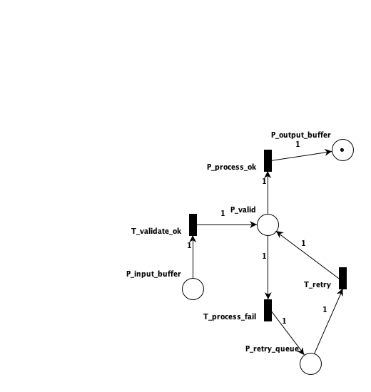
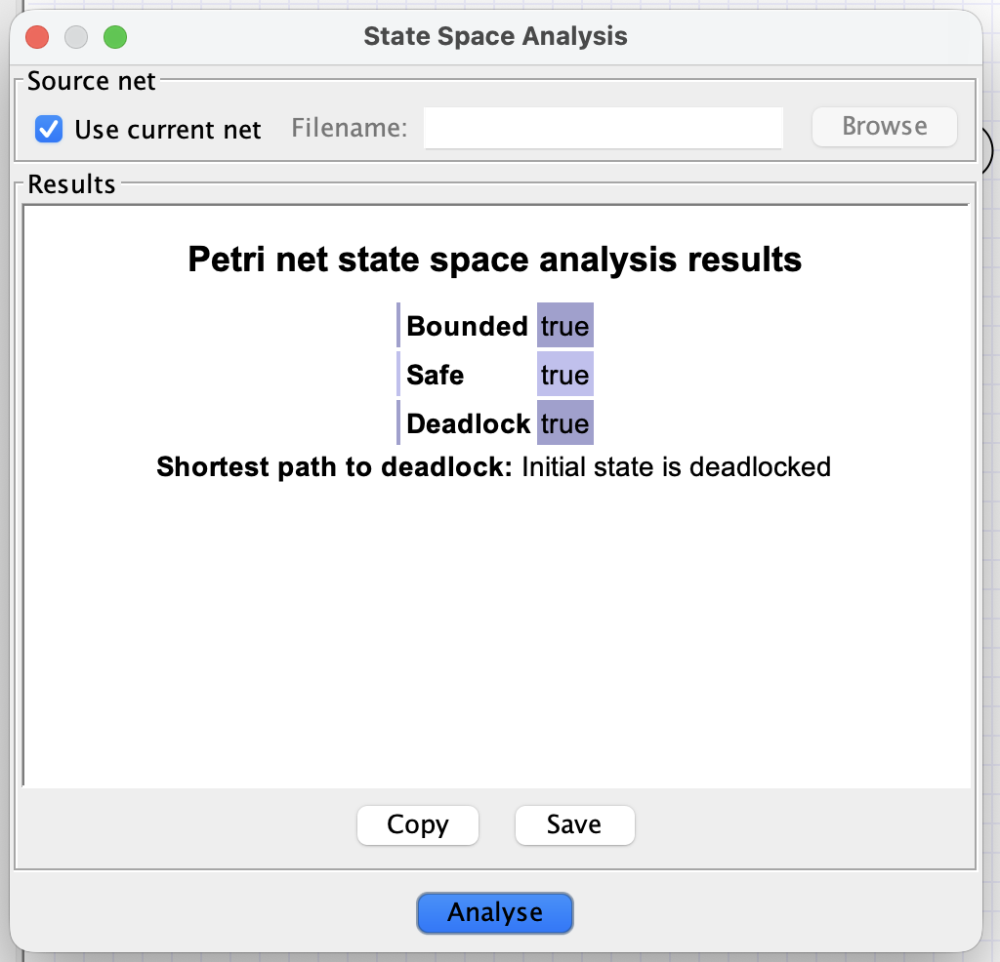
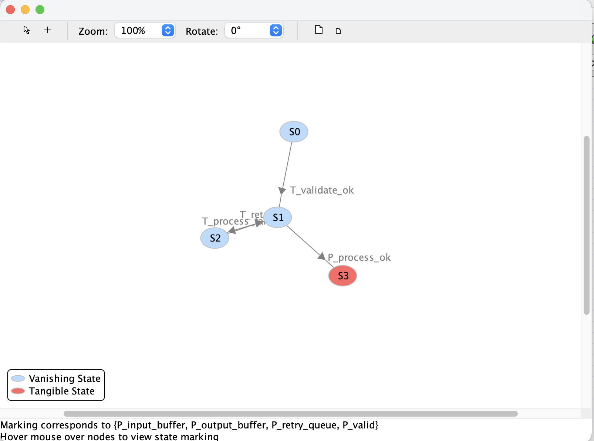
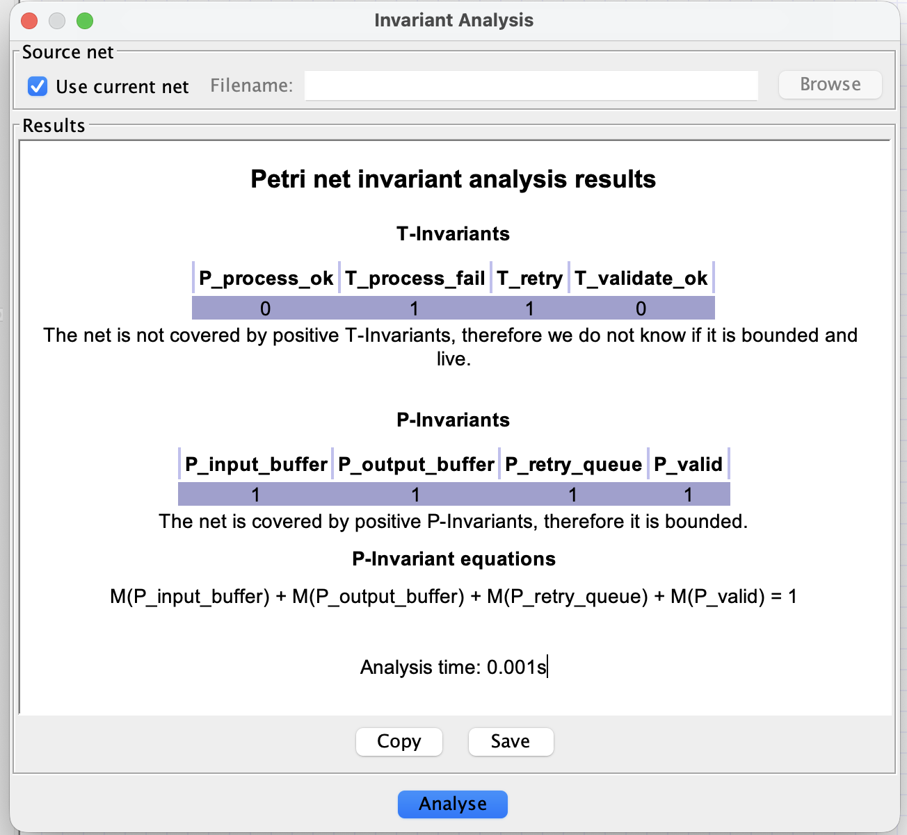

**Opis i wnioski:**

* **Analiza grafu osiągalności:**
  * **Jakie znakowania są osiągalne?**: Na podstawie wygenerowanego grafu widoczne są 4 osiągalne znakowania (stany): S0 (początkowe), S1, S2 oraz S3 (końcowe).
  * **Maksymalna liczba znaczników (wnioski o ograniczoności):** Maksymalna liczba znaczników w dowolnym miejscu wynosi 1. Potwierdza to wynik analizy przestrzeni stanów (*Bounded: true*, *Safe: true*). Sieć jest zatem ograniczona i bezpieczna.
  * **Czy każde przejście jest krawędzią w grafie (żywotność przejść)?:** Tak, wszystkie tranzycje zdefiniowane w sieci (`T_validate_ok`, `T_process_fail`, `T_retry`, `P_process_ok`) pojawiają się na grafie jako krawędzie. Oznacza to, że nie ma martwych przejść.
  * **Wnioski o żywotności sieci:** Sieć **nie jest żywa** w rozumieniu teorii sieci Petriego, ponieważ posiada stan zakleszczenia (S3), z którego nie wychodzą żadne krawędzie. Jest to jednak zachowanie celowe dla procesu, który ma się zakończyć sukcesem.

* **Analiza niezmienników (Invariants):**
  * **T-invariants (odwracalność):** Sieć **nie jest w pełni odwracalna**. Istnieje co prawda cykl powrotny (pętla S1 $\leftrightarrow$ S2 reprezentująca "retry"), ale po przejściu do stanu S3 nie ma możliwości powrotu do stanu początkowego S0.
  * **P-invariants (zachowawczość):** Analiza struktury wskazuje, że sieć jest **zachowawcza**. Suma znaczników w sieci jest stała i zawsze wynosi 1 (token wędruje między miejscami, nie jest powielany ani tracony bezpowrotnie).

## Zadanie 2 – Analiza sieci (odwracalność i żywotność)

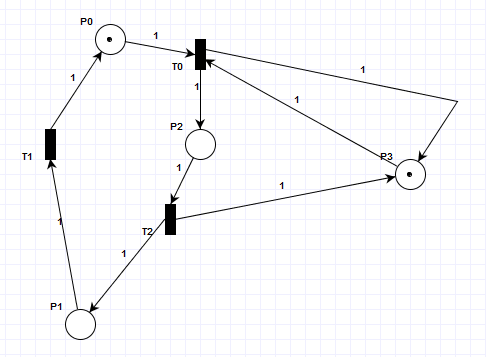
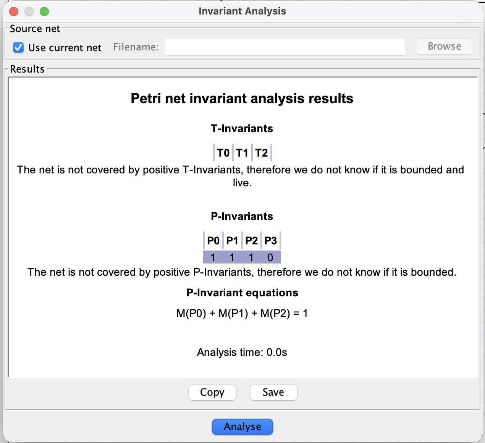
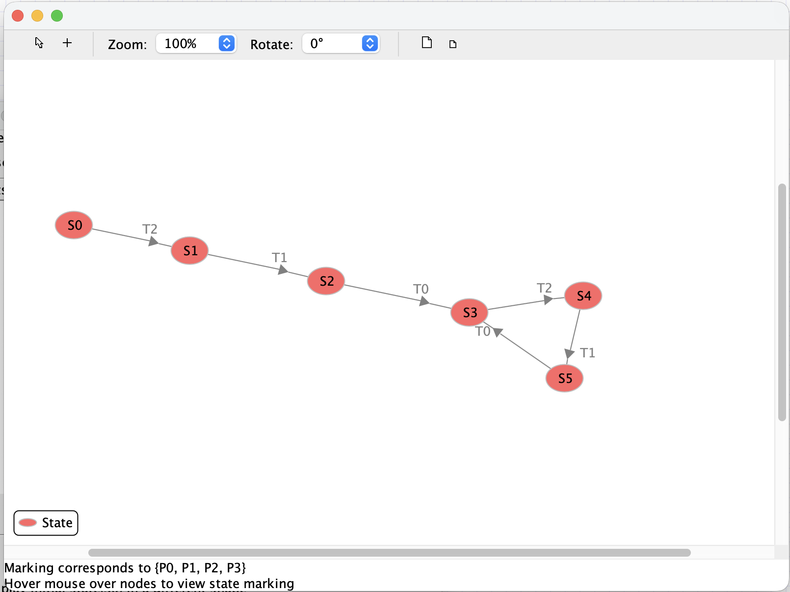

**Opis i wnioski:**

* **Analiza niezmienników przejść (T-invariants) i odwracalność:**
  * **Wynik analizy:** Tabela T-Invariants jest pusta (program wyświetlił komunikat: *"The net is not covered by positive T-Invariants"*).
  * **Wniosek o odwracalności:** Brak niezmienników przejść (lub brak ich pełnego pokrycia) sugeruje, że sieć **nie jest odwracalna**.
  * **Potwierdzenie w grafie:** Analiza grafu osiągalności potwierdza ten wniosek. Widzimy ścieżkę początkową (S0 $\to$ S1 $\to$ S2), która prowadzi do cyklu (S3 $\to$ S4 $\to$ S5 $\to$ S3). Po wejściu w ten cykl, powrót do stanu początkowego S0 (i stanów pośrednich S1, S2) jest niemożliwy. Stan początkowy jest stanem przejściowym, a nie powracalnym.

* **Analiza grafu osiągalności (Liveness & Boundedness):**
  * **Czy sieć jest żywa?**: **Tak, sieć jest żywa.**
    * *Uzasadnienie:* Graf osiągalności wpada w pętlę (S3 $\to$ S4 $\to$ S5 $\to$ S3), w której biorą udział wszystkie tranzycje sieci (T0, T1, T2). Z każdego osiągalnego stanu wewnątrz tego cyklu można wykonać dowolną inną tranzycję (bezpośrednio lub po kilku krokach). Nie występuje tu stan martwy (deadlock).
  * **Czy sieć jest ograniczona?**: **Tak, sieć jest ograniczona.**
    * *Uzasadnienie:* Graf osiągalności jest skończony (posiada tylko 6 węzłów: S0-S5), co jest dowodem na ograniczoność sieci (liczba znaczników nie rośnie w nieskończoność).
    * *Analiza P-invariants:* Dodatkowo równanie niezmienników miejsc $M(P0) + M(P1) + M(P2) = 1$ wskazuje, że suma znaczników w tych trzech miejscach jest stała i zawsze wynosi 1. Oznacza to, że te konkretne miejsca są 1-ograniczone (bezpieczne). Miejsce P3 również nie gromadzi znaczników w nieskończoność, co widać po zamkniętym cyklu w grafie.

---

## Zadanie 3 – Wzajemne wykluczanie

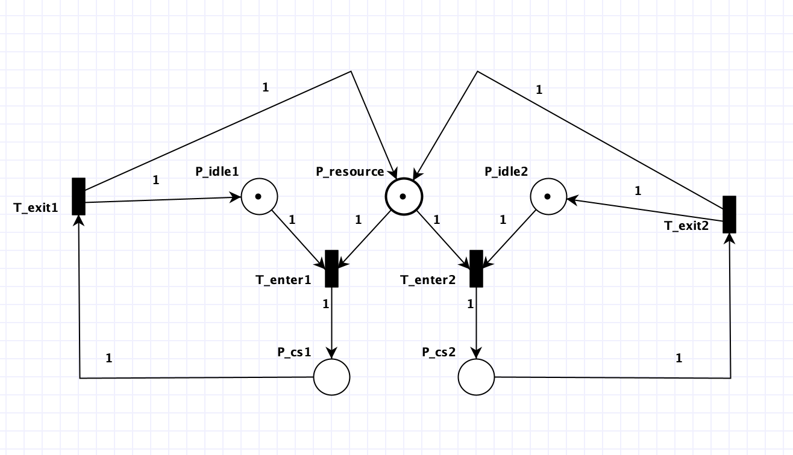
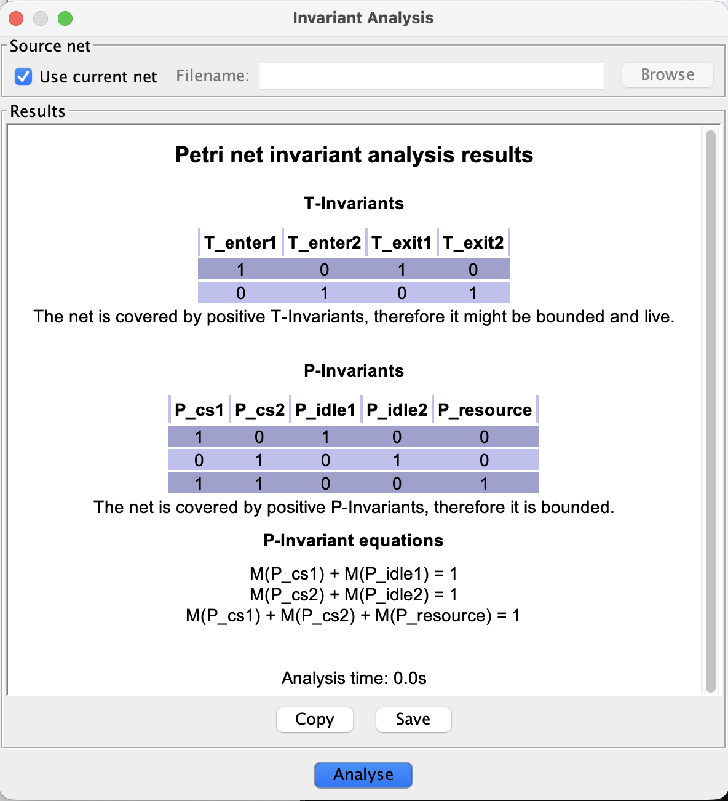

**Opis i wnioski:**

* **Analiza niezmienników miejsc (P-invariants):**
  * Analiza wykazała **pełne pokrycie sieci** przez niezmienniki miejsc, co potwierdza ograniczoność sieci.
  * **Równanie 1:** `M(P_cs1) + M(P_idle1) = 1` — Proces 1 może być albo w stanie bezczynności (idle), albo w sekcji krytycznej (cs). Suma znaczników jest stała i wynosi 1.
  * **Równanie 2:** `M(P_cs2) + M(P_idle2) = 1` — Proces 2 może być albo w stanie bezczynności (idle), albo w sekcji krytycznej (cs). Suma znaczników jest stała i wynosi 1.
  * **Równanie 3:** `M(P_cs1) + M(P_cs2) + M(P_resource) = 1` — **To równanie reprezentuje ochronę sekcji krytycznej**. Suma znaczników w obu sekcjach krytycznych oraz w zasobie zawsze wynosi 1, co oznacza, że:
    * Jeśli zasób jest dostępny (M(P_resource) = 1), to żaden proces nie jest w sekcji krytycznej (M(P_cs1) = 0 i M(P_cs2) = 0).
    * Jeśli jeden proces jest w sekcji krytycznej (np. M(P_cs1) = 1), to zasób jest zajęty (M(P_resource) = 0) i drugi proces nie może wejść do swojej sekcji krytycznej (M(P_cs2) = 0).
    * To gwarantuje **wzajemne wykluczanie** — nigdy nie może być sytuacji, w której oba procesy jednocześnie znajdują się w sekcjach krytycznych.

* **Analiza niezmienników przejść (T-invariants):**
  * Istnieją dwa niezależne cykle: `[T_enter1, T_exit1]` oraz `[T_enter2, T_exit2]`, co oznacza, że każdy proces może niezależnie wejść i wyjść ze swojej sekcji krytycznej, powracając do stanu początkowego. Sieć jest zatem **odwracalna**.

---

## Zadanie 4 – Producent i Konsument (bufor ograniczony)

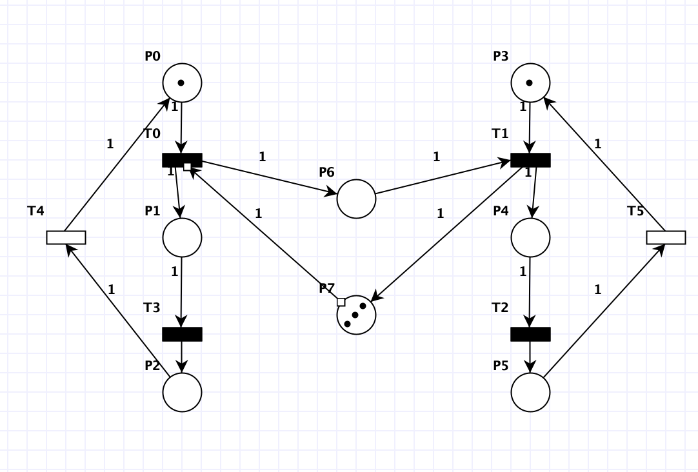
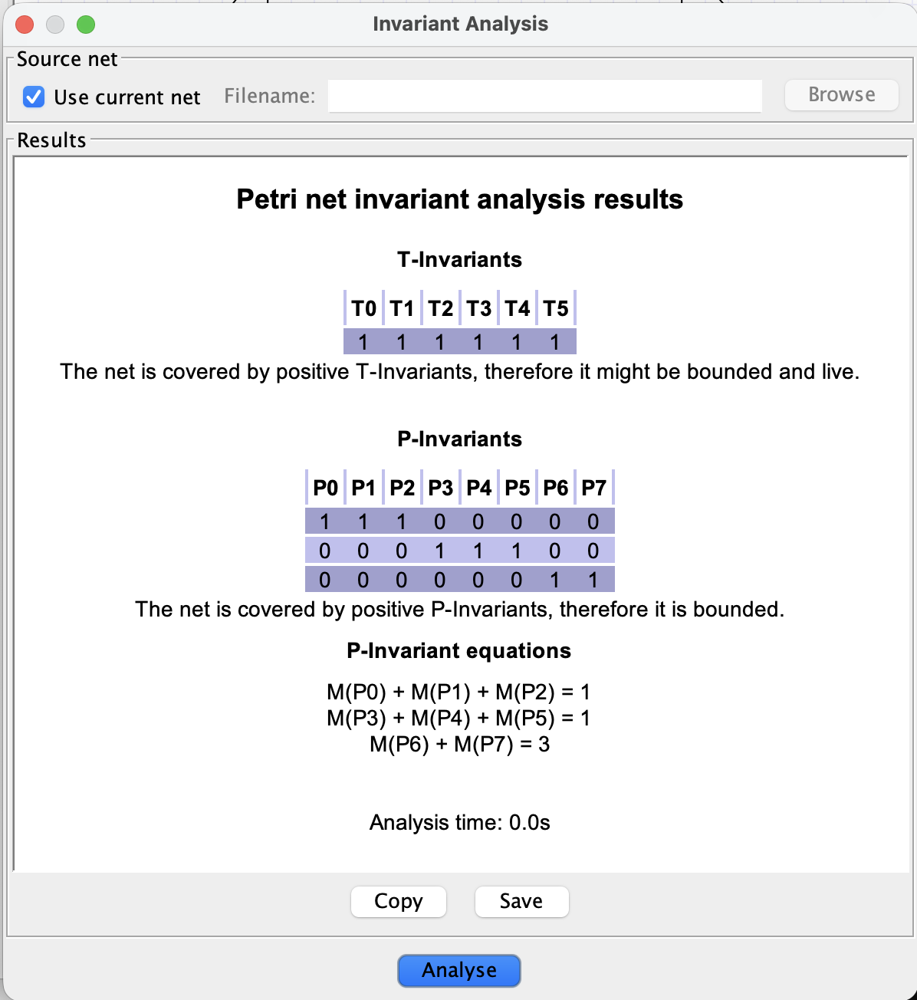

**Opis i wnioski:**

* **Analiza niezmienników miejsc (P-invariants):**
  * Analiza wykazała **pełne pokrycie sieci** przez niezmienniki miejsc, co potwierdza ograniczoność sieci.
  * **Równanie 1:** `M(P0) + M(P1) + M(P2) = 1` — Reprezentuje cykl życia producenta. Suma znaczników w miejscach związanych z producentem jest stała i wynosi 1.
  * **Równanie 2:** `M(P3) + M(P4) + M(P5) = 1` — Reprezentuje cykl życia konsumenta. Suma znaczników w miejscach związanych z konsumentem jest stała i wynosi 1.
  * **Równanie 3:** `M(P6) + M(P7) = 3` — **To równanie mówi nam o rozmiarze bufora**. Suma znaczników w miejscach reprezentujących wolne miejsca w buforze (P6) oraz zajęte miejsca w buforze (P7) jest stała i wynosi **3**, co oznacza, że maksymalna pojemność bufora to 3 elementy.

* **Czy sieć jest zachowawcza?**
  * **Tak, sieć jest zachowawcza**. Analiza niezmienników miejsc wykazała pełne pokrycie wszystkich miejsc sieci. Oznacza to, że całkowita liczba znaczników w sieci jest stała (w tym przypadku: 1 + 1 + 3 = 5 znaczników). Znaczniki nie są tworzone ani tracone, tylko przemieszczają się między miejscami.

* **Analiza niezmienników przejść (T-invariants):**
  * Istnieje pełne pokrycie przez T-invarianty (wszystkie przejścia T0-T5 mają wartość 1), co oznacza, że każde przejście musi zostać wykonane dokładnie raz, aby sieć powróciła do stanu początkowego. Potwierdza to **odwracalność** i **cykliczność** sieci — procesy producenta i konsumenta mogą działać w nieskończonej pętli.

---

## Zadanie 5 – Producent i Konsument (bufor nieograniczony)

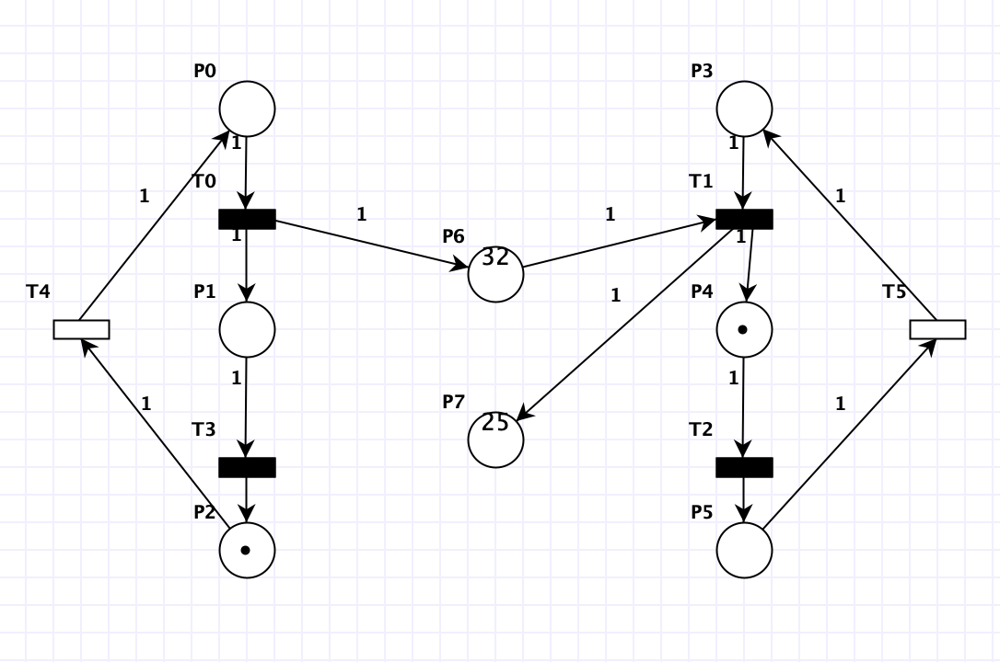
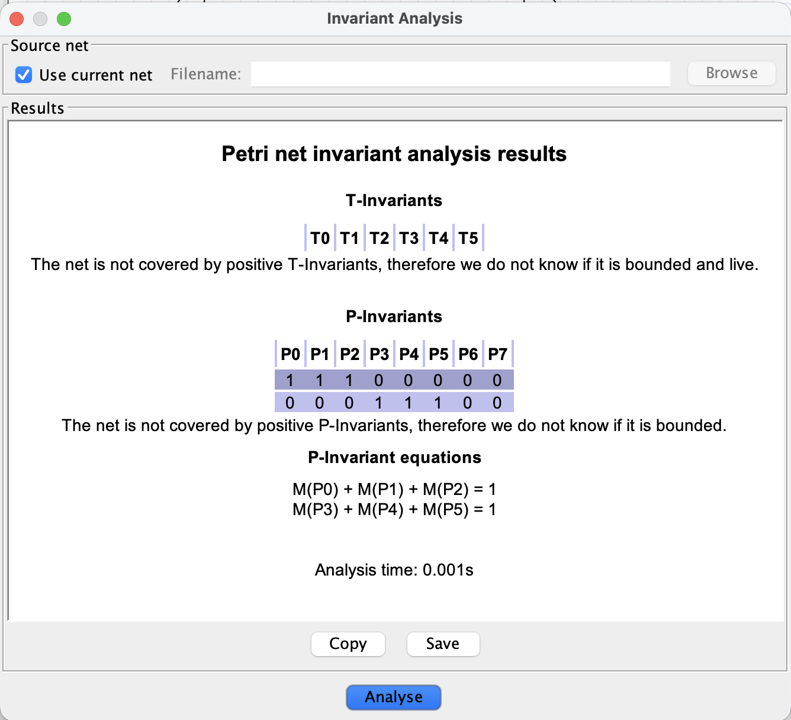

**Opis i wnioski:**

* **Analiza niezmienników miejsc (P-invariants):**
  * **Brak pełnego pokrycia miejsc** — Analiza wykazała, że sieć **nie jest pokryta w pełni** przez niezmienniki miejsc. Komunikat "The net is not covered by positive P-Invariants, therefore we do not know if it is bounded" potwierdza, że nie wszystkie miejsca są objęte równaniami niezmienników.
  * **Równanie 1:** `M(P0) + M(P1) + M(P2) = 1` — Reprezentuje cykl życia producenta (podobnie jak w zadaniu 4).
  * **Równanie 2:** `M(P3) + M(P4) + M(P5) = 1` — Reprezentuje cykl życia konsumenta (podobnie jak w zadaniu 4).
  * **Brak równania dla bufora:** W przeciwieństwie do zadania 4, miejsca P6 i P7 (reprezentujące bufor) **nie są objęte żadnym równaniem niezmiennika**. Oznacza to, że suma znaczników w buforze nie jest stała i może rosnąć w nieskończoność.

* **Wnioski o ograniczoności:**
  * **Sieć nie jest ograniczona**. Brak pokrycia miejsc bufora przez P-invarianty wskazuje, że liczba znaczników w buforze może rosnąć bez ograniczeń. Producent może nieustannie dodawać elementy do bufora, niezależnie od tego, czy konsument je odbiera, co prowadzi do **nieograniczonego wzrostu**.
  * W praktyce oznacza to, że bufor może zapełnić się dowolną liczbą elementów, co odzwierciedla koncepcję **bufora nieskończonego** (nieograniczonego).

* **Analiza niezmienników przejść (T-invariants):**
  * **Brak T-invariantów** — Analiza wykazała brak niezmienników przejść, co sugeruje, że sieć może nie być odwracalna. System może oddalać się od stanu początkowego w miarę jak bufor się zapełnia.

---

## Zadanie 6 – Zakleszczenie (Deadlock)

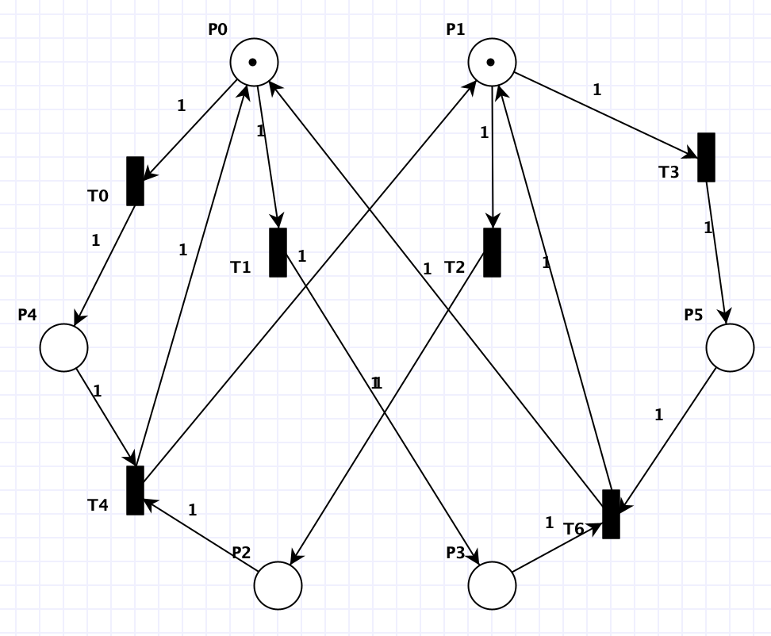
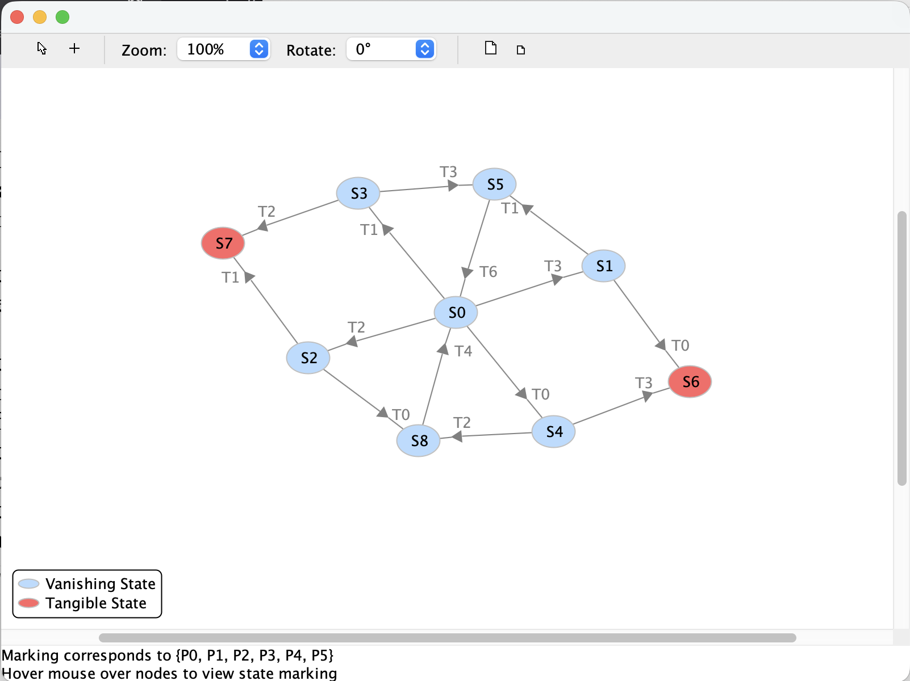
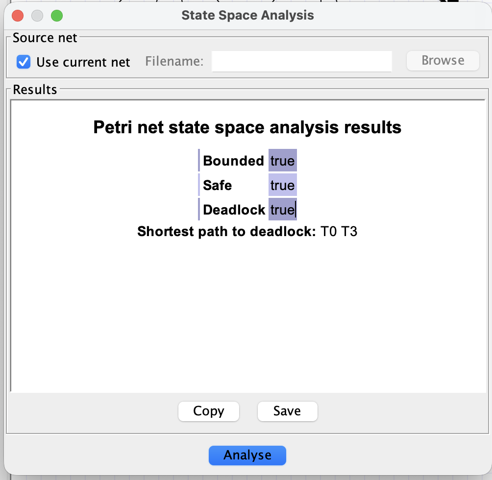

**Opis i wnioski:**

* **Analiza grafu osiągalności:**
  * Graf osiągalności zawiera **9 stanów** (S0-S8), w tym dwa stany oznaczone na czerwono jako **Tangible State**: **S6 i S7**.
  * **Stany zakleszczenia:** Stany S6 i S7 są stanami **deadlock** — nie wychodzą z nich żadne krawędzie, co oznacza, że po osiągnięciu tych stanów nie można wykonać żadnego przejścia. System zostaje całkowicie zablokowany.
  * Z grafu widać, że zakleszczenie jest osiągalne z różnych ścieżek, np.:
    * S0 → T6 → S0 → T0 → S4 → T3 → S6 (deadlock)
    * S0 → T3 → S1 → T0 → S6 (deadlock)
  * Pozostałe stany (niebieskie - Vanishing State) nie prowadzą do zakleszczenia lub mogą wykonywać dalsze przejścia.

* **Analiza przestrzeni stanów (State Space Analysis):**
  * **Bounded: true** — Sieć jest ograniczona. Liczba znaczników w każdym miejscu nie przekracza określonej wartości.
  * **Safe: true** — Sieć jest bezpieczna (1-ograniczona). W żadnym miejscu nie występuje więcej niż 1 znacznik jednocześnie.
  * **Deadlock: true** — Potwierdza istnienie możliwości zakleszczenia w sieci.
  * **Shortest path to deadlock: T0 T3** — Najkrótsza ścieżka prowadząca do zakleszczenia to wykonanie przejść T0, a następnie T3 ze stanu początkowego. Po wykonaniu tej sekwencji system osiąga stan zakleszczenia (S6), z którego nie można już kontynuować działania.

* **Wnioski:**
  * Sieć modeluje sytuację, w której dwa procesy mogą **wpaść w zakleszczenie** (deadlock), gdy każdy z nich zajmie jeden zasób i będzie oczekiwał na drugi zasób zajęty przez drugi proces.
  * Analiza potwierdza, że zakleszczenie jest **osiągalne** i **nieuniknione** przy pewnych sekwencjach działań (np. T0 T3).
  * Sieć nie jest żywa, ponieważ istnieją stany (S6, S7), z których nie można wykonać żadnych przejść, co prowadzi do całkowitego zatrzymania systemu.
